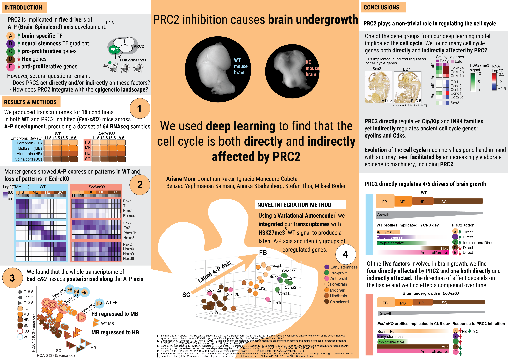

*********************************************************************************************************
Deep Learning Decodes Multi-layered Roles of Polycomb Repressor Complex 2 During Mouse CNS Development
*********************************************************************************************************

Information
===========
This site hosts the information associated with the paper: **Deep Learning Decodes Multi-layered Roles of Polycomb Repressor Complex 2 During Mouse CNS Development**.
Here we provide the code and data used for all the analyses in the paper and link to the packages we developed as part of
producing the paper.

Links to analyses and data
--------------------------

- Preprint: `bioRxiv <https://doi.org/10.1101/2021.06.22.449386>`_
- HTML outputs are available on the left panel
- Code and processed data is available at: `mouseCNS_vae <https://github.com/ArianeMora/mouseCNS_vae>`_
- Raw RNA-seq files are available at the NCBI/Gene Expression Omnibus under the accession GSE123331

Links to developed packages
---------------------------
- Reproducible Variational autoencoder: `scivae <https://arianemora.github.io/scivae/>`_
- Epigenetic annotation to genes in python `scie2g <https://arianemora.github.io/sciepi2gene/>`_
- Biomart python wrapper `scibiomart <https://arianemora.github.io/scibiomart/>`_
- Visualisation library for chart formatting `sciviso <https://github.com/ArianeMora/sciviso/>`_

Authors
=======

Ariane Mora1, Jonathan Rakar3, Ignacio Monedero Cobeta3*, Behzad Yaghmaeian Salmani3#, Annika Starkenberg3, Stefan Thor2,3$, Mikael Bodén1

1) School of Chemistry and Molecular Biosciences
2), and School of Biomedical Sciences, University of Queensland, St Lucia QLD 4072, Australia.
3) Department of Clinical and Experimental Medicine, Linkoping University, SE-58185, Linkoping, Sweden.

Current addresses: #) Department of Cell and Molecular Biology, Karolinska Institute, SE-171 65, Stockholm, Sweden.
*Department of Physiology, Universidad Autonoma de Madrid, Madrid, Spain.
$) School of Biomedical Sciences, University of Queensland, St Lucia QLD 4072, Australia

Absract
=======
A prominent aspect of most, if not all, central nervous systems (CNSs) is that anterior regions (brain) are
larger than posterior ones (spinal cord). Studies in Drosophila and mouse have revealed that the Polycomb Repressor Complex 2 (PRC2)
acts by several mechanisms to promote anterior CNS expansion. However, it is unclear if PRC2 acts directly and/or indirectly
upon key downstream genes, what the full spectrum of PRC2 action is during embryonic CNS development and how PRC2 integrates
with the epigenetic landscape. We removed PRC2 function from the developing mouse CNS, by mutating the key gene Eed, and
generated spatio-temporal transcriptomic data. We developed a bioinformatics workflow that incorporates standard
statistical analyses with machine learning to integrate the transcriptomic response to PRC2 inactivation with epigenetic
information from ENCODE. This multi-variate analysis corroborates the central involvement of PRC2 in anterior CNS expansion,
and reveals layered regulation via PRC2. These findings uncover a differential logic for the role of PRC2 upon functionally
distinct gene categories that drive CNS anterior expansion. To support the analysis of emerging multi-modal datasets,
we provide a novel bioinformatics package that can disentangle regulatory underpinnings of heterogeneous biological processes.
Code for our scivae package is available at `sci-vae <https://github.com/ArianeMora/scivae>`_.

Getting in touch
=================

Please contact ST (s.thor@uq.edu.au), MB (m.boden@uq.edu.au), and AM (a.mora@uq.edu.au)

Citing the preprint
===================
Link to preprint

.. toctree::
   :caption: Package info
   :maxdepth: 1

   about
   installing/index

.. toctree::
   :caption: Reproducibility
   :maxdepth: 1

   examples/apAxis_datasetGeneration
   examples/apAxis_between-cond-time
   examples/apAxis_between-cond-tissue
   examples/apAxis_between-time
   examples/apAxis_between-tissue

   examples/consistently_affected_3_nodes
   examples/significantly_affected_3_nodes
   examples/consistently_affected_6_nodes
   examples/significantly_affected_6_nodes
   examples/significantly_affected_3_nodes

.. toctree::
   :caption: About
   :maxdepth: 1

   faq
   changelog
   references
